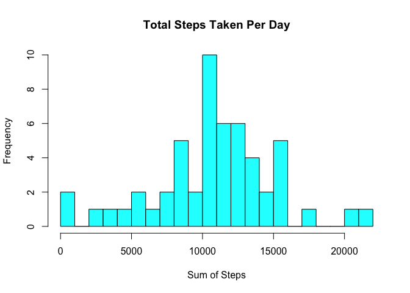

# Reproducible Research: Peer Assessment 1


## Loading and preprocessing the data


```r
unzip("activity.zip","activity.csv")
activity <- read.csv("activity.csv")

#Cleanup our file
file.remove("activity.csv")
```

```
## [1] TRUE
```

```r
head(activity)
```

```
##   steps       date interval
## 1    NA 2012-10-01        0
## 2    NA 2012-10-01        5
## 3    NA 2012-10-01       10
## 4    NA 2012-10-01       15
## 5    NA 2012-10-01       20
## 6    NA 2012-10-01       25
```


## What is mean total number of steps taken per day?

```r
steps.per.day <- aggregate(activity$steps,list(activity$date),sum)
colnames(steps.per.day) <-c("Date","Steps")

mean.steps.daily1 <- mean(steps.per.day$Steps,na.rm=TRUE)
median.steps.daily1 <- median(steps.per.day$Steps,na.rm=TRUE)

hist(steps.per.day$Steps,
     xlab="Sum of Steps",
     breaks=20,
     main="Total Steps Taken Per Day",
     col=c("cyan"))
```

 

The mean is <b>10766.19</b> and median is <b>10765.00</b> of the total number of steps taken per day.

## What is the average daily activity pattern?

1. A time series plot of the 5-minute interval and the average number of steps taken, averaged across all days


```r
avg.number.steps.perinterval <- tapply(activity$steps,activity$interval,mean, na.rm=TRUE)
max.number.steps <- as.integer(names(avg.number.steps.perinterval[which.max(avg.number.steps.perinterval)]))
max.label.offset <- max.number.steps + 400
plot(names(avg.number.steps.perinterval), 
     avg.number.steps.perinterval, 
     type="l", 
     main = "Average Number of Steps", 
     xlab="5 minute Intervals", 
     ylab="Avg. Steps",
     col=c("red"))
abline(v=max.number.steps,col=c("blue"),lwd=2)
text(max.label.offset,200,paste("Max Number of Steps: ",max.number.steps),cex=0.5)
```

 

2. The average across all the days in the dataset, contains the maximum number of steps:
<b>835</b>

## Imputing missing values

1. Representation of the total number of missing values in the dataset, <b><i>per type</i></b>

```r
apply(is.na(activity),2,sum)
```

```
##    steps     date interval 
##     2304        0        0
```
2. We are now going to replace the steps with NA values with the already caluclated mean of the corresponding interval (avg.number.steps.perinterval). For example if the 5 interval is NA, we will replace it with avg.number.steps.perinterval["5"]


```r
# We leave the original data as is and use a copy in case we need it again later
activity.no.NA <- activity
# Logical list of NA values
L <- is.na(activity.no.NA$steps)
# All of our NA rows
naactivity <- activity.no.NA[L,]

# naactivity's structure is such that the row names are actually the index of the rows in cc we can go through them and change the steps values from NA to the mean of that interval
#row.names  steps    date	    interval
#   1	        NA	2012-10-01	    0

for(idx in as.integer(rownames(naactivity))) { 
  activity.no.NA[idx,]$steps <- as.integer(avg.number.steps.perinterval[as.character(activity.no.NA[idx,3])]) 
}
```

Histogram of the total number of stepst aken each day, with our new data with no NA values


```r
steps.per.day.no.NA <- aggregate(activity.no.NA$steps,list(activity.no.NA$date),sum)
colnames(steps.per.day.no.NA) <-c("Date","Steps")
mean.steps.daily2 <- mean(steps.per.day.no.NA$Steps,na.rm=TRUE)
median.steps.daily2 <- median(steps.per.day.no.NA$Steps,na.rm=TRUE)

x <-steps.per.day.no.NA$Steps


h<-hist(x,
     xlab="Sum of Steps",
     breaks=20,
     main="Total Steps Taken Per Day",
     col=c("cyan"))
#abline(v=mean(mean.steps.daily2,rm.na=TRUE),col=c("red"),lwd=2)
#abline(v=mean(mean.steps.daily1,rm.na=TRUE),col=c("blue"),lwd=2)
#abline(v=mean(median.steps.daily1,rm.na=TRUE),col=c("green"),lwd=2)
abline(v=mean(median.steps.daily1,rm.na=TRUE),col=c("red"),lwd=2)

xfit<-seq(min(x),max(x),length=25000) 
yfit<-dnorm(xfit,mean=mean(x),sd=sd(x)) 
yfit <- yfit*diff(h$mids[1:2])*length(x) 
lines(xfit, yfit, col="blue", lwd=2)
```

 

As illustrated by the straight lines "abline()" added for the mean and median with and without NA values, there is not much of a difference between the 2 sets of values since there is no way to tell the lines apart.  

The mean is <b>10749.77</b> and median is <b>10641.00</b> of the total number of steps taken per day.


## Are there differences in activity patterns between weekdays and weekends?
Creating a new factor variable in the dataset with two levels – “weekday” and “weekend”. If  weekdays() returns Saturday or Sunday it's a weekend, otherwise it's a weekday.

We can observe on the graph that there tends to be a higther intensity per interval on the weekends.


```r
activity.no.NA$period <- ifelse(weekdays(as.Date(activity.no.NA$date)) %in% c("Saturday","Sunday"), "weekend", "weekday")


library(plyr)
plotData <- ddply(activity.no.NA, .(interval,period), summarize, steps = mean(steps, na.rm=TRUE))

library(ggplot2)
ggplot(data=plotData, aes(x=interval, y=steps, group=period)) + geom_line(aes(color=period))+ facet_wrap(~ period, nrow=2)
```

 
